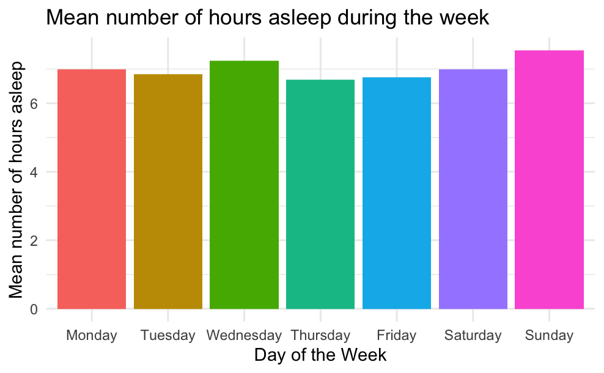

# Bellabeat case study - Google Data Analytics Capstone Project

### Introduction

This case study is proposed on the course "Google Data Analytics Professional Certificate" offered on Coursera. I followed the steps of the analysis process as I've learned during the course, that consist in six phases: 1) ask, 2) prepare, 3) process, 5) analyze, 6) share, 6) act.

Before to start with the analysis, I want to thank you all for your interest and invite you to share your thaughts about this work.

### Scenario

Bellabeat is a high-tech manufacturer of health-focused products for women, with the potential to become a large player in the global smart device market. The company was founded by Urška Sršen and Sando Mur in 2013. By 2016, Bellabeat had launched multiple products, available through online retailers in addition to their own e-commerce channel. Regarding its communication, the company has in invested in traditional advertising media but focuses on digital marketing extensively.

## 1) Ask

### Business task

I have been required to analyze data about smart device usage in order to gain insight into how consumers use non-Bellabeat devices; then I have to apply these insights to one of the Bellabeat products. The analysis will be guide by the following questions: 1. What are some trends in sma 2. How could these trends apply to Bellabeat customers? 3. How could these trends help influence Bellabeat marketing strategy? Analyzing smart device fitness data and identify trends could help unlock new growth opportunities for the company.

### Key stakeholders

1.  Urška Sršen: She is the Bellabeat's cofounder and Chief Creative Office. Sršen used her artistic beckground to develop beatifully designed technology tha inspires women. She is the primary stakeholder of this project, because she asked the analysis in order to gain high-level recommendations and inform with these the Bellabeat Marketing Strategy.
2.  Bellabeat marketing analytics team: A team of data analysts responsible for collecting, analyzing, and reporting data that helps guide Bellabeat's marketing strategy. They partially depend on my work for their own tasks, then they are secondary stakeholders.
3.  Bellabeat executive team: the executive team that will decide wether to approve the reccomended marketing program. Sando Mur, the other cofounder of the company, is a key member of this team; he have a background as mathematician.

## 2) Prepare

The CFO Sršen has invited me to use public data that explores smart device users' daily habits. In particular, she points me to a specific dataset: [FitBit Fitness Tracker Data](https://www.kaggle.com/datasets/arashnic/fitbit).

In order to help address the possible limitations the data set might have, Sršen invite me to consider adding another data.

### • Inspection of the Dataset **FitBit Finess Tracker Data**:

#### Location of the data

The data are stored in Kaggle and made available by the user Mobius.

#### Organization of the data

The data are organized in two folder, that correspond to different periods in which data were recorded. In the first folder there are 11 .csv files each of which referred to a different recorded metrics. In the second folder there are instead 18 files, with the same metrics recorded and in addition seven more.

In these documents, data are organized in a long format, i.e. the subjects have data in multiple rows.

The following list cointains the name files, in whose is expressed the measured metric, and the columns in which data are organized:

**Folder Fitabase Data 3.12.16-4.11.16**

-   dailyActivity_merged

    -   Id, ActivityDate, TotalSteps, TotalDistance(km), TrackerDistance, LoggedActivitiesDistance, VeryActiveDistance, ModeratelyActiveDistance, LightActiveDistance, SedentaryActiveDistance, VeryActiveMinutes, FairlyActiveMinutes, LightlyActiveMinutes, SedentaryMinutes, Calories (Total estimated energy expenditure (in kilocalories).)

-   heartrate_seconds_merged

    -   Id, Time, Value

-   hourlyCalories_merged

    -   Id, ActivityHour, Calories

-   hourlyIntensities_merged (Value calculated by adding all the minute-level intensity values that occurred within the hour.)

    -   Id, ActivityHour, TotalIntensity, AverageIntensity

-   hourlySteps_merged

    -   Id, ActivityHour, TotalIntensity, AverageIntensity

-   minuteCaloriesNarrow_merged (Total number of estimated calories burned)I

    -   Id, ActivityMinute, Calories

-   minuteIntensitiesNarrow_merged (Intensity value: 0 = Sedentary; 1 = Light; 2 = Moderate; 3 = Very Active)

    -   Id, ActivityMinute, Intensity

-   minuteMETsNarrow_merged (MET value for the given minute. Important: All MET values are multiplied by 10. Divide by 10 to get accurate MET values. Example: 10 = 1.0 METs; 38 = 3.8 METs)

    -   Id, ActivityMinute, METs

-   minuteSleep_merged

    -   Id, date, value, logId

-   minuteStepsNarrow_merged

    -   Id, ActivityMinute, Steps

-   weightLogInfo_merged

    -   Id, Date, WeightKg, WeightPounds, Fat, BMI, IsManualReport, LogId

**Folder Fitabase Data 4.12.16-5.12.16**

-   dailyActivity_merged

    -   Id, ActivityDate, TotalSteps, TotalDistance, TrackerDistance, LoggedActivitiesDistance, VeryActiveDistance, ModeratelyActiveDistance, LightActiveDistance, SedentaryActiveDistance, VeryActiveMinutes, FairlyActiveMinutes, LightlyActiveMinutes, SedentaryMinutes, Calories

-   dailyCalories_merged

    -   Id, ActivityDay, Calories

-   dailyIntensities_merged

    -   Id, ActivityDay, SedentaryMinutes, LightlyActiveMinutes, FairlyActiveMinutes, VeryActiveMinutes, SedentaryActiveDistance, LightActiveDistance, ModeratelyActiveDistance, VeryActiveDistance

-   dailySteps_merged

    -   Id, ActivityDay, StepTotal

-   heartrate_seconds_merged

    -   Id, Time, Value

-   hourlyCalories_merged

    -   Id, ActivityHour, Calories

-   hourlyIntensities_merged (The total intensity is the value calculated by adding all the minute-level intensity values that occurred within the hour)

    -   Id, ActivityHour, TotalIntensity, AverageIntensity

-   hourlySteps_merged

    -   Id, ActivityHour, StepTotal

-   minuteCaloriesNarrow_merged

    -   Id, ActivityMinute, Calories (Total number of estimated calories burned.)

-   minuteCaloriesWide_merged (Total number of estimated calories burned. Example: Calories05 = calories burned in fifth minute of the hour.)

    -   Id, ActivityHour, Calories00, Calories01, Calories02, Calories03, Calories04, Calories05, Calories06, Calories07, Calories08, Calories09, Calories10, Calories11, Calories12, Calories13, Calories14, Calories15, Calories16, Calories17, Calories18, Calories19, Calories20, Calories21, Calories22, Calories23, Calories24, Calories25, Calories26, Calories27, Calories28, Calories29, Calories30, Calories31, Calories32, Calories33, Calories34, Calories35, Calories36, Calories37, Calories38, Calories39, Calories40, Calories41, Calories42, Calories43, Calories44, Calories45, Calories46, Calories47, Calories48, Calories49, Calories50, Calories51, Calories52, Calories53, Calories54, Calories55, Calories56, Calories57, Calories58, Calories59

-   minuteIntensitiesNarrow_merged

    -   Id,ActivityMinute,Intensity

-   minuteIntensitiesWide_merged

    -   Id, ActivityHour, Intensity00, Intensity01, Intensity02, Intensity03, Intensity04, Intensity05, Intensity06, Intensity07, Intensity08, Intensity09, Intensity10, Intensity11, Intensity12, Intensity13, Intensity14, Intensity15, Intensity16, Intensity17, Intensity18, Intensity19, Intensity20, Intensity21, Intensity22, Intensity23, Intensity24, Intensity25, Intensity26, Intensity27, Intensity28, Intensity29, Intensity30, Intensity31, Intensity32, Intensity33, Intensity34, Intensity35, Intensity36, Intensity37, Intensity38, Intensity39, Intensity40, Intensity41, Intensity42, Intensity43, Intensity44, Intensity45, Intensity46, Intensity47, Intensity48, Intensity49, Intensity50, Intensity51, Intensity52, Intensity53, Intensity54, Intensity55, Intensity56, Intensity57, Intensity58, Intensity59

-   minuteMETsNarrow_merged

    -   Id, ActivityMinute, METs

-   minuteSleep_merged

    -   Id, date, value, logId

-   minuteStepsNarrow_merged

    -   Id, ActivityMinute, Steps

-   minuteStepsWide_merged (Steps00 - Steps59: Total number of steps taken in each minute. )

    -   Id, ActivityHour, Steps00, Steps01, Steps02, Steps03, Steps04, Steps05, Steps06, Steps07, Steps08, Steps09, Steps10, Steps11, Steps12, Steps13, Steps14, Steps15, Steps16, Steps17, Steps18, Steps19, Steps20, Steps21, Steps22, Steps23, Steps24, Steps25, Steps26, Steps27, Steps28, Steps29, Steps30, Steps31, Steps32, Steps33, Steps34, Steps35, Steps36, Steps37, Steps38, Steps39, Steps40, Steps41, Steps42, Steps43, Steps44, Steps45, Steps46, Steps47, Steps48, Steps49, Steps50, Steps51, Steps52, Steps53, Steps54, Steps55, Steps56, Steps57, Steps58, Steps59

-   sleepDay_merged

    -   Id, SleepDay, TotalSleepRecords, TotalMinutesAsleep, TotalTimeInBed

-   weightLogInfo_merged

    -   Id, Date, WeightKg, WeightPounds, Fat, BMI, IsManualReport, LogId
    
    
the data sets "data_activity_merged" contain data about steps, calories burned and intensities of the activities played during the day. So I decide to utilize the follow data sets (whereby is necessary, merging two data sets in which are recorded data from different periods):

- dailyActivity_merged 
- sleepDay_merged
- weightLogInfo_merged

#### Verify R.O.C.C.C.

R.O.C.C.C. stands for Reliable, Original, Comprehensive, Current, Cited. These are attributes which it's necessary to verify in a dataset in order to understand the good or bad quality of a the dataset itself.

These are my evaluations about this dataset:

-   **Reliability**: MEDIUM-LOW. The accuracy is good; data are collected through tracker so it's possible observe them with a very high granularity. Despite that, data is not complete: there are several type of metrics recorded only in the second period and not in the first one. Last but not least, the sample 0f 35 seems too little. In the field of probability and statistics, as a consequence of the *Central Limit Theorem* it's quite common to accept a minimum sample size of 30. But in this case we cannot know how many women have been observed, and this is important due to the fact that the the principal target market of the company for which the analysis is carried out is made up of women. So it's very likely that the sample size composed of people falling into the target is less than 30.

-   **Originality**: LOW. The dataset provided contains third-party data, because they aren't collected from Bellabeat devices and also the Kaggle user found them from another source. This means is necessary to be careful in understanding data.

-   **Comprehensiveness** MEDIUM-LOW. Data are about activites recorded during the devices' usage. These could partially answer to the need to highlight trends in the use of the same device. However, is not possible to distinguish between male and female users, and it would be important because the principal target market of the company for which the analysis is carried out is made up of women.

-   **Currency**: MEDIUM. Data are collected in 2016; so they're not strictly current, but for this kind of analysis they can still highlight interesting trends.

-   **Citation**: HIGH. The original source of the data is cited by other sources, including scientific studies publicized in credible scientific journals.

Based on this evaluation, I decided to add more data sources in order to increase the accuracy of the analysis.

I particular, I will exctract insight from the sources of data ["LifeSnaps: a 4-month multi-modal dataset capturing unobtrusive snapshots of our lives in the wild"](https://zenodo.org/records/7229547) and ["Assessment of ownership of smart devices and the acceptability of digital health data sharing"](https://www.nature.com/articles/s41746-024-01030-x#citeas)

### • Inspection of the Dataset **LifeSnaps: a 4-month multi-modal dataset capturing unobtrusive snapshots of our lives in the wild**:

#### Location of the source of data

This data set is stored in Zenodo, an open dissemination research data repository for the preservation and making available of research, educational and informational content.

#### Organization of the data

The .csv files of this source present data of daily and hourly granularity. The file who presents a daily granularity cointains the following fields:

-   id
-   date
-   nightly_temperature (Skin temperature is the temperature on the skin’s surface, measured during nighttime at regular intervals)
-   nremhr
-   rmssd (Root Mean Square of Successive Differences between normal heartbeats measured in milliseconds. Normal values: 42±15)
-   spo2 (Blood oxygen saturation (SpO2) is the percentage of the blood that’s saturated with or contains oxygen)
-   full_sleep_breathing_rate
-   stress_score (Stress score estimates how the body responds to stress based on heart rate, sleep, and activity level data; the range is 0-100, with a higher score indicating the body is showing fewer physical signs of stress)
-   sleep_points_percentage (sleep score consider individual scores in sleep duration, sleep quality, and restoration, for a total score of up to 100. Sleep score ranges are: Excellent: 90-100; Good: 80-89; Fair: 60-79; Poor: Less than 60)
-   exertion_points_percentage
-   responsiveness_points_percentage
-   daily_temperature_variation (Skin temperature variation from a 3-day baseline temperature, measured during nighttime)
-   badgeType
-   calories
-   filteredDemographicVO2Max (VO₂ max refers to the maximum amount of oxygen your body can absorb and use during exercise. It measures your aerobic fitness levels)
-   distance
-   activityType
-   bpm (Beats Per Minute)
-   lightly_active_minutes
-   moderately_active_minutes
-   very_active_minutes
-   sedentary_minutes
-   mindfulness_session
-   scl_avg (Skin conductivity level; it reflects the level of psychological or physiological arousal, elicited by cognition or emotions.)
-   resting_hr
-   sleep_duration
-   minutesToFallAsleep
-   minutesAsleep
-   minutesAwake
-   minutesAfterWakeup
-   sleep_efficiency
-   sleep_deep_ratio
-   sleep_light_ratio
-   sleep_rem_ratio
-   steps
-   minutes_in_default_zone_1
-   minutes_below_default_zone_1
-   minutes_in_default_zone_2
-   minutes_in_default_zone_3
-   age
-   gender
-   bmi
-   step_goal
-   min_goal
-   max_goal
-   step_goal_label
-   ALERT
-   HAPPY
-   NEUTRAL
-   RESTED/RELAXED
-   SAD
-   TENSE/ANXIOUS
-   TIRED
-   ENTERTAINMENT
-   GYM
-   HOME
-   HOME_OFFICE
-   OTHER
-   OUTDOORS
-   TRANSIT
-   WORK/SCHOOL

The file who presents a hourly granularity cointains the following fields:

-   id
-   date
-   hour
-   temperature
-   badgeType
-   calories
-   distance
-   activityType
-   bpm
-   mindfulness_session
-   scl_avg
-   steps
-   minutes_in_default_zone_1
-   minutes_below_default_zone_1
-   minutes_in_default_zone_2
-   minutes_in_default_zone_3
-   age
-   gender
-   bmi
-   step_goal
-   min_goal
-   max_goal
-   step_goal_label
-   ALERT
-   HAPPY
-   NEUTRAL
-   RESTED/RELAXED
-   SAD
-   TENSE/ANXIOUS
-   TIRED
-   ENTERTAINMENT
-   GYM
-   HOME
-   HOME_OFFICE
-   OTHER
-   OUT
-   TRANSIT
-   WORK/SCHOOL

#### Verify R.O.C.C.C.

-   **Reliability**: MEDIUM-HIGH. The accuracy is good; data are summarized daily and hourly, this seems a sufficient granularity. The data apparently is complete.

-   **Originality**: MEDIUM. Data is from a second-party source, but is collected with a reliable scientific and statistical method.

-   **Comprehensiveness**: MEDIUM. Data are about activites recorded during the devices' usage. These could partially answer to the need to highlight trends in the use of the same device. In this case is possible to distinguish between male and female users, but regarding the age, there are only two groups: smaller than 30 and equal or greater than 30.

-   **Currency**: MEDIUM. Data is collected during 2021, during the implementation of social distancing measures for the prevention of Covid-19, this could may have affected the behaviour of the partecipants.

-   **Citation**: HIGH. The original source of the data is cited by other sources, including scientific studies publicized in credible scientific journals.

### • Inspection of the source of data **Assessment of ownership of smart devices and the acceptability of digital health data sharing**:

#### Location of the source

The source is an article where are reported findings of a survey, publicized in "npj Digital Medicine" is an open access, peer-reviewed journal, specialized in publications about digital medicine and health.

#### Organization of the data

The survey study consisted of 14 questions to determine ownership, usage, frequency and reason for usage of smart devicesand wearable, willingness to participate in digital health studies even sharing data collected by smart devices, type of data the respondent are comfortable sharing and why; in addition, demogrphic information such as gender and age group.

#### Quality of the sources of data

In this case data is already summarized, and it's not possible to access to the raw data. Data is from a second-party source but collected with a reliable scientific and statistical method. The topics of the survey are very similar to the business question, so this source will be very useful to answer to the need to highlight trends in the use of the smart devices who record health data of their owners. Data is recorded in January 2022, so is very current. Finally, The original source of the data is cited by other sources, including scientific studies publicized in credible scientific journals.

#### Adressing licensing, privacy, security and accessibility

All sources of data are licensed under a Creative Commons Attribution 4.0 International License. There aren't private data, so the use of these sources of data is secure from a privacy-protection point of view. Theoretically, in a real analysis data would be stored in a secure location with restricted access, especially with personal and sensitive data.

#### Relevance of the data

With this combination of data sources, it's possible to gain insight capable of providing a sufficiently comprehensive answer to the questions asked. In particular,it is possible to understand how smart devices are used for recording information on physical activities and health status, as well the willingness and opinions on the use and sharing of the data recorded for research purposes by potential and current users.

## 3) Process

### Fitbit Dataset

First of all it is necessary to import all the data frames of the first data set.

```{r}

install.packages("tidyverse")

```

```{r}

library(tidyverse)
library(lubridate)
library(dplyr)
library(ggplot2)
```

```{r}
daily_activity_1 <- read_csv("/Users/f.p./Desktop/G.d.a.c./8/case_study_2/fitbit_30_users_dataset/mturkfitbit_export_3.12.16-4.11.16/Fitabase Data 3.12.16-4.11.16/dailyActivity_merged.csv")

heartrate_1 <- read_csv("/Users/f.p./Desktop/G.d.a.c./8/case_study_2/fitbit_30_users_dataset/mturkfitbit_export_3.12.16-4.11.16/Fitabase Data 3.12.16-4.11.16/heartrate_seconds_merged.csv")

calories_hourly_1 <- read_csv("/Users/f.p./Desktop/G.d.a.c./8/case_study_2/fitbit_30_users_dataset/mturkfitbit_export_3.12.16-4.11.16/Fitabase Data 3.12.16-4.11.16/hourlyCalories_merged.csv")

intensities_hourly_1 <- read_csv("/Users/f.p./Desktop/G.d.a.c./8/case_study_2/fitbit_30_users_dataset/mturkfitbit_export_3.12.16-4.11.16/Fitabase Data 3.12.16-4.11.16/hourlyIntensities_merged.csv")

steps_hourly_1 <- read_csv("/Users/f.p./Desktop/G.d.a.c./8/case_study_2/fitbit_30_users_dataset/mturkfitbit_export_3.12.16-4.11.16/Fitabase Data 3.12.16-4.11.16/hourlySteps_merged.csv")

calories_minute_narrow_1 <- read_csv("/Users/f.p./Desktop/G.d.a.c./8/case_study_2/fitbit_30_users_dataset/mturkfitbit_export_3.12.16-4.11.16/Fitabase Data 3.12.16-4.11.16/minuteCaloriesNarrow_merged.csv")

intensities_minute_narrow_1 <- read_csv("/Users/f.p./Desktop/G.d.a.c./8/case_study_2/fitbit_30_users_dataset/mturkfitbit_export_3.12.16-4.11.16/Fitabase Data 3.12.16-4.11.16/minuteIntensitiesNarrow_merged.csv")

met_minute_narrow_1 <- read_csv("/Users/f.p./Desktop/G.d.a.c./8/case_study_2/fitbit_30_users_dataset/mturkfitbit_export_3.12.16-4.11.16/Fitabase Data 3.12.16-4.11.16/minuteMETsNarrow_merged.csv")

sleep_minute_1 <- read_csv("/Users/f.p./Desktop/G.d.a.c./8/case_study_2/fitbit_30_users_dataset/mturkfitbit_export_3.12.16-4.11.16/Fitabase Data 3.12.16-4.11.16/minuteSleep_merged.csv")

steps_minute_narrow_1 <- read_csv("/Users/f.p./Desktop/G.d.a.c./8/case_study_2/fitbit_30_users_dataset/mturkfitbit_export_3.12.16-4.11.16/Fitabase Data 3.12.16-4.11.16/minuteStepsNarrow_merged.csv")

weight_log_info_1 <- read_csv("/Users/f.p./Desktop/G.d.a.c./8/case_study_2/fitbit_30_users_dataset/mturkfitbit_export_3.12.16-4.11.16/Fitabase Data 3.12.16-4.11.16/weightLogInfo_merged.csv")

daily_activity_2 <- read_csv("/Users/f.p./Desktop/G.d.a.c./8/case_study_2/fitbit_30_users_dataset/mturkfitbit_export_4.12.16-5.12.16/Fitabase Data 4.12.16-5.12.16/dailyActivity_merged.csv")

calories_daily <- read_csv("/Users/f.p./Desktop/G.d.a.c./8/case_study_2/fitbit_30_users_dataset/mturkfitbit_export_4.12.16-5.12.16/Fitabase Data 4.12.16-5.12.16/dailyCalories_merged.csv")

intensities_daily <-  read_csv("/Users/f.p./Desktop/G.d.a.c./8/case_study_2/fitbit_30_users_dataset/mturkfitbit_export_4.12.16-5.12.16/Fitabase Data 4.12.16-5.12.16/dailyIntensities_merged.csv")

steps_daily <- read_csv("/Users/f.p./Desktop/G.d.a.c./8/case_study_2/fitbit_30_users_dataset/mturkfitbit_export_4.12.16-5.12.16/Fitabase Data 4.12.16-5.12.16/dailySteps_merged.csv")

heartrate_2 <- read_csv("/Users/f.p./Desktop/G.d.a.c./8/case_study_2/fitbit_30_users_dataset/mturkfitbit_export_4.12.16-5.12.16/Fitabase Data 4.12.16-5.12.16/heartrate_seconds_merged.csv")

calories_hourly_2 <- read_csv("/Users/f.p./Desktop/G.d.a.c./8/case_study_2/fitbit_30_users_dataset/mturkfitbit_export_4.12.16-5.12.16/Fitabase Data 4.12.16-5.12.16/hourlyCalories_merged.csv")

intensities_hourly_2 <- read_csv("/Users/f.p./Desktop/G.d.a.c./8/case_study_2/fitbit_30_users_dataset/mturkfitbit_export_4.12.16-5.12.16/Fitabase Data 4.12.16-5.12.16/hourlyIntensities_merged.csv")

steps_hourly_2 <- read_csv("/Users/f.p./Desktop/G.d.a.c./8/case_study_2/fitbit_30_users_dataset/mturkfitbit_export_4.12.16-5.12.16/Fitabase Data 4.12.16-5.12.16/hourlySteps_merged.csv")

calories_minute_narrow_2 <- read_csv("/Users/f.p./Desktop/G.d.a.c./8/case_study_2/fitbit_30_users_dataset/mturkfitbit_export_4.12.16-5.12.16/Fitabase Data 4.12.16-5.12.16/minuteCaloriesNarrow_merged.csv")

calories_minute_wide <- read_csv("/Users/f.p./Desktop/G.d.a.c./8/case_study_2/fitbit_30_users_dataset/mturkfitbit_export_4.12.16-5.12.16/Fitabase Data 4.12.16-5.12.16/minuteCaloriesWide_merged.csv")

intensities_minute_narrow_2 <- read_csv("/Users/f.p./Desktop/G.d.a.c./8/case_study_2/fitbit_30_users_dataset/mturkfitbit_export_4.12.16-5.12.16/Fitabase Data 4.12.16-5.12.16/minuteIntensitiesNarrow_merged.csv")

intensities_minute_wide <- read_csv("/Users/f.p./Desktop/G.d.a.c./8/case_study_2/fitbit_30_users_dataset/mturkfitbit_export_4.12.16-5.12.16/Fitabase Data 4.12.16-5.12.16/minuteIntensitiesWide_merged.csv")

met_minute_narrow_2 <- read_csv("/Users/f.p./Desktop/G.d.a.c./8/case_study_2/fitbit_30_users_dataset/mturkfitbit_export_4.12.16-5.12.16/Fitabase Data 4.12.16-5.12.16/minuteMETsNarrow_merged.csv")

sleep_minute_2 <- read_csv("/Users/f.p./Desktop/G.d.a.c./8/case_study_2/fitbit_30_users_dataset/mturkfitbit_export_4.12.16-5.12.16/Fitabase Data 4.12.16-5.12.16/minuteSleep_merged.csv")

steps_minute_narrow_2 <- read_csv("/Users/f.p./Desktop/G.d.a.c./8/case_study_2/fitbit_30_users_dataset/mturkfitbit_export_4.12.16-5.12.16/Fitabase Data 4.12.16-5.12.16/minuteStepsNarrow_merged.csv")

steps_minute_wide <- read_csv("/Users/f.p./Desktop/G.d.a.c./8/case_study_2/fitbit_30_users_dataset/mturkfitbit_export_4.12.16-5.12.16/Fitabase Data 4.12.16-5.12.16/minuteStepsWide_merged.csv")

sleep_daily <- read_csv("/Users/f.p./Desktop/G.d.a.c./8/case_study_2/fitbit_30_users_dataset/mturkfitbit_export_4.12.16-5.12.16/Fitabase Data 4.12.16-5.12.16/sleepDay_merged.csv")

weight_log_info_2 <- read_csv("/Users/f.p./Desktop/G.d.a.c./8/case_study_2/fitbit_30_users_dataset/mturkfitbit_export_4.12.16-5.12.16/Fitabase Data 4.12.16-5.12.16/weightLogInfo_merged.csv")
```

Now it is possible to merge those data that are contained in more than one file

```{r}

calories_hourly <- bind_rows(calories_hourly_1, calories_hourly_2)
calories_minute_narrow <- bind_rows(calories_minute_narrow_1, calories_minute_narrow_2)
daily_activity <- bind_rows(daily_activity_1, daily_activity_2)
heartrate <- bind_rows(heartrate_1, heartrate_2)
intensities_hourly <- bind_rows(intensities_hourly_1, intensities_hourly_2)
intensities_minute_narrow <- bind_rows(intensities_minute_narrow_1, intensities_minute_narrow_2)
met_minute_narrow <- bind_rows(met_minute_narrow_1, met_minute_narrow_2)
sleep_minute <- bind_rows(sleep_minute_1, sleep_minute_2)
steps_hourly <- bind_rows(steps_hourly_1, steps_hourly_2)
steps_minute_narrow <-  bind_rows(steps_minute_narrow_1, steps_minute_narrow_2)
weight_log_info <- bind_rows(weight_log_info_1,weight_log_info_2)

```

Now the first data set is ready to be cleaned.

```{r}
install.packages("here")
install.packages("skimr")
install.packages("janitor")
```

```{r}
library(here)
library(skimr)
library(janitor)
```

```{r}
#obtaining summaries


skim_without_charts(daily_activity)
skim_without_charts(sleep_daily)
skim_without_charts(weight_log_info)


```

```{r}

glimpse(daily_activity)
glimpse(sleep_daily)
glimpse(weight_log_info)
```
```{r}
head(daily_activity)
head(sleep_daily)
head(weight_log_info)
```

Observation:
- In the dataset sleep_daily the moment of the record does not require the hour
  as_date('name_column')
  
```{r}
n_distinct(daily_activity$Id)
n_distinct(sleep_daily$Id)
n_distinct(weight_log_info$Id)
```
In the Fitbit data frame, the people who have registered data about their own weight data are too few. I will not consider this data. 

- checking type of values
```{r}
typeof(daily_activity$Id)
typeof(sleep_daily$Id)
```

The variable "Id" is double in all the data sets considered; it's better to change the format in order to treat these values as nominals.

- To check for duplicates and NA values in the data set
```{r}
sum(duplicated(daily_activity)) 
sum(duplicated(sleep_daily)) 

sum(is.na(daily_activity))
sum(is.na(sleep_daily))
```
  
  The result is the same of the previus research, so now we are sure that all the NA values in the weight dataset are in the "Fat" column.
  
```{r}
activities_cl <- daily_activity %>% 
  drop_na() %>% # removing rows with any NA values
  n_distinct() %>% # removing duplicate rows
  as.character(daily_activity$Id) # converting to string type the id column
print(activities_cl)
```
```{r}
activity_cl <- daily_activity %>% 
  na.omit() %>% # removing rows with any NA values
  distinct() %>% # removing duplicate rows
  mutate(Id = as.character(Id)) %>% # converting to string type the id column
  mutate(ActivityDate = as.Date(ActivityDate, format = "%m/%d/%Y")) %>% 
  rename(Date = ActivityDate)

head(activity_cl)
```

```{r}
sleep_cl <- sleep_daily %>% 
  na.omit() %>% # removing rows with any NA values
  distinct() %>%  # removing duplicate rows
  mutate(SleepDay = as.Date(SleepDay, format = "%m/%d/%Y")) %>% 
  rename(Date = SleepDay) %>% 
  mutate(Id = as.character(Id))


head(sleep_cl)
```


#### Merging activity and sleep dataframes 

```{r}
# creating a new dataframe by merging activity and sleep records

fitbit_cl <- 
  merge(activity_cl, sleep_cl, by = c("Id","Date"))

head(fitbit_cl)
```

#### Creating a new column for the days of the week
```{r}
fitbit_cl <- fitbit_cl %>% 
  mutate(day_of_week = weekdays(Date))

fitbit_cl
```


### LifeSnap Dataset

Importing csv files

```{r}
lifesnaps <- read_csv("/Users/f.p./Desktop/G.d.a.c./8/case_study_2/rais_anonymized/csv_rais_anonymized/daily_fitbit_sema_df_unprocessed.csv")
```
```{r}
head(lifesnaps)

```
- to drop:
nightly_temperature
nremhr
rmssd
spo2
full_sleep_breathing_rate
stress_score
sleep_points_percentage
exertion_points_percentage
responsiveness_points_percentage
daily_temperature_variation
badgeType
filteredDemographicVO2Max
bpm
scl_avg
resting_hr
sleep_efficiency
sleep_deep_ratio
sleep_wake_ratio
sleep_light_ratio
sleep_rem_ratio
minutes_in_default_zone_1
minutes_below_default_zone_1
minutes_in_default_zone_2
minutes_in_default_zone_3
step_goal
min_goal
max_goal
step_goal_label


```{r}
count <- lifesnaps %>% 
  filter(lifesnaps$gender == "FEMALE", na.rm = TRUE) %>% 
  distinct(id, keep_all = TRUE) %>% 
  nrow()

print(count)
```

Dropping undesired columns

```{r}
lifesnaps_cl <- lifesnaps %>% 
  filter(lifesnaps$gender == "FEMALE", na.rm = TRUE) %>% 
  select(-nightly_temperature, -nremhr, -rmssd, -spo2, -full_sleep_breathing_rate, -stress_score, -sleep_points_percentage, -exertion_points_percentage, -responsiveness_points_percentage, -daily_temperature_variation, -badgeType, -filteredDemographicVO2Max, -bpm, -scl_avg, -resting_hr, -sleep_efficiency, -sleep_deep_ratio, -sleep_wake_ratio, -sleep_light_ratio, -sleep_rem_ratio, -minutes_in_default_zone_1, -minutes_below_default_zone_1, -minutes_in_default_zone_2, -minutes_in_default_zone_3, -step_goal, -min_goal, -max_goal, -step_goal_label, -ALERT, -HAPPY, -NEUTRAL, -`RESTED/RELAXED`, -SAD, -`TENSE/ANXIOUS`, -TIRED, -ENTERTAINMENT, -GYM, -HOME, - HOME_OFFICE, -OTHER, -OUTDOORS, -TRANSIT, -`WORK/SCHOOL`) %>% 
  na.omit() %>% 
  distinct()

head(lifesnaps)
head(lifesnaps_cl)
n_distinct(lifesnaps_cl$id)
```
creating a new column for the days of the week
```{r}
lifesnaps_cl <- lifesnaps_cl %>% 
  mutate(day_of_week = weekdays(date))

lifesnaps_cl
```


## 4) Analyze

### Activities

#### Summaries of activities

```{r}
# Fitbit - summary for every type of activity

fitbit_cl %>%
  select(VeryActiveMinutes, FairlyActiveMinutes, LightlyActiveMinutes, SedentaryMinutes) %>%
  summary()
```

```{r}
# Lifesnaps - summary for every type of activity

lifesnaps_cl %>% 
  select(very_active_minutes, moderately_active_minutes, lightly_active_minutes, sedentary_minutes) %>% 
  summary()
```


#### Mean minutes of activity during the week - tibbles
 
```{r}
# Fitbit - tibble activities during the week

activities_week_fb <- fitbit_cl %>% 
  group_by(day_of_week) %>% # grouping by day of the week
  summarize(
    mean_minutes = mean(VeryActiveMinutes + FairlyActiveMinutes + LightlyActiveMinutes) # mean of minutes of activity 
  ) %>% 
  arrange(match(day_of_week, c("Monday", "Tuesday", "Wednesday", "Thursday", "Friday", "Saturday", "Sunday")))

print(activities_week_fb)
```

```{r}
# Lifesnaps - tibble activities during the week

activities_week_ls <- lifesnaps_cl %>% 
  group_by(day_of_week) %>% # grouping by day of the week
  summarize(
    mean_minutes = mean(very_active_minutes + moderately_active_minutes + lightly_active_minutes) # mean of minutes of activity 
  ) %>% 
  arrange(match(day_of_week, c("Monday", "Tuesday", "Wednesday", "Thursday", "Friday", "Saturday", "Sunday")))

print(activities_week_ls)
```

#### Mean minutes of activity during the week - plots

```{r}
# Fitbit - plots of mean minutes of activity during the week

ggplot(activities_week_fb %>% 
         mutate(day_of_week = factor(day_of_week, levels = c("Monday", "Tuesday", "Wednesday", "Thursday", "Friday", "Saturday", "Sunday"))), aes(x = day_of_week, y= mean_minutes, fill = day_of_week))+
  geom_bar(stat = "identity") +
  ggtitle("Mean minutes of activity during the week")+
  xlab("Day of the Week") + 
  ylab("Mean minutes") +
  theme_minimal() +
  theme(legend.position = "none")
```

```{r}
# Lifesnaps - plot mean minutes of activity during the week
ggplot(activities_week_ls %>% 
         mutate(day_of_week = factor(day_of_week, levels = c("Monday", "Tuesday", "Wednesday", "Thursday", "Friday", "Saturday", "Sunday"))), aes(x = day_of_week, y= mean_minutes, fill = day_of_week))+
  geom_bar(stat = "identity") +
  ggtitle("Mean minutes of activity during the week")+
  xlab("Day of the Week") + 
  ylab("Mean minutes of activity") +
  theme_minimal() +
  theme(legend.position = "none")  # add , axis.text.x = element_text(angle = 45, hjust = 1) to rotate x-axis labels by 45 degrees
```

In both data frames are recorded more activities in the weekend and in the Monday.


### Steps

#### Summaries of records about steps

```{r}
# Fitbit - summary of data about steps

fitbit_cl %>% 
  select(TotalSteps) %>% 
  summary()
```

```{r}
# Fitbit - summary of data about steps

 lifesnaps_cl%>% 
  select(steps) %>% 
  summary()
```

The two data frame show differences. In the Fitbit records, the first quartile reaches a maximum of almost 5000 steps in the same day, and a median of aproximately 8700 steps. In the Lifesnaps record, instead, the first quartile reach the 9000 steps and the media is more than 12000.

#### Boxplots of records about steps


```{r}
# Fitbit - boxplot steps

ggplot(fitbit_cl, aes(x = TotalSteps)) + 
  geom_boxplot()
```

```{r}
# Lifesnaps - boxplot steps
ggplot(lifesnaps_cl, aes(x = steps)) + 
  geom_boxplot()
```

#### Mean steps during the week - tibbles

```{r}
# Fitbit - Tibble mean steps during the week

steps_week_fb <- fitbit_cl %>% 
  group_by(day_of_week) %>% # grouping by day of the week
  summarize(
    mean_steps = mean(TotalSteps) # mean of steps
  ) %>% 
  arrange(match(day_of_week, c("Monday", "Tuesday", "Wednesday", "Thursday", "Friday", "Saturday", "Sunday")))

print(steps_week_fb)
```

```{r}
# Lifesnaps - Tibble mean steps during the week

steps_week_ls <- lifesnaps_cl %>% 
  group_by(day_of_week) %>% # grouping by day of the week
  summarize(
    mean_steps = mean(steps) # mean of steps
  ) %>% 
  arrange(match(day_of_week, c("Monday", "Tuesday", "Wednesday", "Thursday", "Friday", "Saturday", "Sunday")))

print(steps_week_ls)
```

#### Mean steps during the week - plots

```{r}
# Fitbit - plot mean steps during the week

ggplot(steps_week_fb %>% 
         mutate(day_of_week = factor(day_of_week, levels = c("Monday", "Tuesday", "Wednesday", "Thursday", "Friday", "Saturday", "Sunday"))), aes(x = day_of_week, y= mean_steps, fill = day_of_week))+
  geom_bar(stat = "identity") +
  ggtitle("Mean number of steps during the week")+
  xlab("Day of the Week") + 
  ylab("Mean number of steps") +
  theme_minimal() +
  theme(legend.position = "none")
```

```{r}
# Lifesnaps - plot mean steps during the week

ggplot(steps_week_ls %>% 
         mutate(day_of_week = factor(day_of_week, levels = c("Monday", "Tuesday", "Wednesday", "Thursday", "Friday", "Saturday", "Sunday"))), aes(x = day_of_week, y= mean_steps, fill = day_of_week))+
  geom_bar(stat = "identity") +
  ggtitle("Mean number of steps during the week")+
  xlab("Day of the Week") + 
  ylab("Mean number of steps") +
  theme_minimal() +
  theme(legend.position = "none")
```


According to the average steps during the week, walks are longer in the Mondays and Saturdays. The Lifesnaps data frame show a little peak also in the Thursday.

### Calories

#### Mean calories during the week - tibbles

```{r}
# Fitbit - tibble mean calories during the week

calories_week_fb <- fitbit_cl %>% 
  group_by(day_of_week) %>% # grouping by day of the week
  summarize(
    mean_calories = mean(Calories) # mean of steps
  ) %>% 
  arrange(match(day_of_week, c("Monday", "Tuesday", "Wednesday", "Thursday", "Friday", "Saturday", "Sunday")))

print(calories_week_fb)
```

```{r}
# Lifesnaps - tibble mean calories during the week

calories_week_ls <- lifesnaps_cl %>% 
  group_by(day_of_week) %>% # grouping by day of the week
  summarize(
    mean_calories = mean(calories) # mean of steps
  ) %>% 
  arrange(match(day_of_week, c("Monday", "Tuesday", "Wednesday", "Thursday", "Friday", "Saturday", "Sunday")))

print(calories_week_ls)
```
#### Mean calories during the week - plots

```{r}
ggplot(calories_week_fb %>% 
         mutate(day_of_week = factor(day_of_week, levels = c("Monday", "Tuesday", "Wednesday", "Thursday", "Friday", "Saturday", "Sunday"))), aes(x = day_of_week, y= mean_calories, fill = day_of_week))+
  geom_bar(stat = "identity") +
  ggtitle("Mean number of calories burned during the week")+
  xlab("Day of the Week") + 
  ylab("Mean calories burned") +
  theme_minimal() +
  theme(legend.position = "none")
```

```{r}
ggplot(calories_week_ls %>% 
         mutate(day_of_week = factor(day_of_week, levels = c("Monday", "Tuesday", "Wednesday", "Thursday", "Friday", "Saturday", "Sunday"))), aes(x = day_of_week, y= mean_calories, fill = day_of_week))+
  geom_bar(stat = "identity") +
  ggtitle("Mean number of calories burned during the week")+
  xlab("Day of the Week") + 
  ylab("Mean calories burned") +
  theme_minimal() +
  theme(legend.position = "none")
```

The Lifesnaps data frame show a lower consume of calories. This could be due to the less needs of calories of the female body.

### Sleep

#### Summary of records about time asleep


```{r}
# Fitbit - summary of records about time asleep

summary_sleep_fb <- fitbit_cl %>% 
  select(TotalMinutesAsleep) %>% 
  summary()

summary_sleep_fb
```

```{r}
# Lifesnaps - summary of records about time asleep

summary_sleep_ls <- lifesnaps_cl %>% 
  select(minutesAsleep) %>% 
  summary()

summary_sleep_ls
```

In the The 50% of the records, the hours asleep are less than 6,8, and  in the 75% of the records the hours asleeps are less than 7,5.

#### Minutes asleep - boxplots

```{r}
# Fitbit - boxplot minutes asleep

ggplot(fitbit_cl, aes(x = TotalMinutesAsleep/60)) + 
  geom_boxplot()
```

```{r}
# Lifesnaps - boxplot minutes asleep

ggplot(lifesnaps_cl, aes(x = minutesAsleep/60)) + 
  geom_boxplot()
```

#### Mean hours asleep during the week - tibbles

```{r}
# Fitbit - tibble mean hours asleep during the week

hours_asleep_week_fb <- fitbit_cl %>% 
  group_by(day_of_week) %>% # grouping by day of the week
  summarize(
    mean_hours_asleep = mean(TotalMinutesAsleep)/60 # mean of hours asleep
  ) %>% 
  arrange(match(day_of_week, c("Monday", "Tuesday", "Wednesday", "Thursday", "Friday", "Saturday", "Sunday")))

print(hours_asleep_week_fb)
```

```{r}
# Lifesnaps - tibble mean hours asleep during the week

hours_asleep_week_ls <- lifesnaps_cl %>% 
  group_by(day_of_week) %>% # grouping by day of the week
  summarize(
    mean_minutes = mean(minutesAsleep/60) # mean of hours asleep
  ) %>% 
  arrange(match(day_of_week, c("Monday", "Tuesday", "Wednesday", "Thursday", "Friday", "Saturday", "Sunday")))

print(hours_asleep_week_ls)
```

Hours asleep filtered based off of the age
```{r}
# Lifesnaps - tibble mean hours asleep during the week, filtered for user less than 30 years old.

hours_asleep_week_ls <- lifesnaps_cl %>% 
  group_by(day_of_week) %>% # grouping by day of the week
  filter(age == "<30") %>% 
  summarize(
    mean_minutes = mean(minutesAsleep/60) # mean of hours asleep
  ) %>% 
  arrange(match(day_of_week, c("Monday", "Tuesday", "Wednesday", "Thursday", "Friday", "Saturday", "Sunday")))

print(hours_asleep_week_ls)
```

```{r}
# Lifesnaps - tibble mean hours asleep during the week, filtered for user with age equal or more than 30 years old.

hours_asleep_week_ls <- lifesnaps_cl %>% 
  group_by(day_of_week) %>% # grouping by day of the week
  filter(age == ">=30") %>% 
  summarize(
    mean_minutes = mean(minutesAsleep/60) # mean of hours asleep
  ) %>% 
  arrange(match(day_of_week, c("Monday", "Tuesday", "Wednesday", "Thursday", "Friday", "Saturday", "Sunday")))

print(hours_asleep_week_ls)
```

#### Mean hours asleep during the week - plots

```{r}
# Fitbit - plot of mean hours asleep during the week

ggplot(hours_asleep_week_fb %>% 
         mutate(day_of_week = factor(day_of_week, levels = c("Monday", "Tuesday", "Wednesday", "Thursday", "Friday", "Saturday", "Sunday"))), aes(x = day_of_week, y= mean_hours_asleep, fill = day_of_week))+
  geom_bar(stat = "identity") +
  ggtitle("Mean number of hours asleep during the week")+
  xlab("Day of the Week") + 
  ylab("Mean number of hours asleep") +
  theme_minimal() +
  theme(legend.position = "none")
```

```{r}
# Lifesnaps - plot of mean hours asleep during the week

ggplot(hours_asleep_week_ls %>% 
         mutate(day_of_week = factor(day_of_week, levels = c("Monday", "Tuesday", "Wednesday", "Thursday", "Friday", "Saturday", "Sunday"))), aes(x = day_of_week, y = mean_minutes, fill = day_of_week)) +
  geom_bar(stat = "identity") +
  ggtitle("Mean of hours asleep during the Week") +
  xlab("Day of the Week") +
  ylab("Hours asleep") +
  theme_minimal() + 
  theme(legend.position = "none")
```

### Bmi

#### distribution of bmi values in Lifesnaps data frame - tibble

```{r}
 bmi_count <- lifesnaps_cl %>%
  group_by(bmi) %>%
  summarise(count = n_distinct(id)) %>% 
  arrange(match(bmi, c("<19", "19.0", "20.0", "21.0", "22.0", "23.0", "24.0", ">=25")))

print(bmi_count)
```

```{r}
ggplot(bmi_count %>% 
         mutate(bmi = factor(bmi, levels = c("<19", "19.0", "20.0", "21.0", "22.0", "23.0", "24.0", ">=25"))), aes(x = bmi, y = count, fill = bmi)) +
  geom_bar(stat = "identity") +
  ggtitle("Distirbution of bmi values") +
  xlab("bmi values") +
  ylab("distinct id") +
  theme_minimal() + 
  theme(legend.position = "none")
```

```{r}

 bmi_fb <- weight_cl %>%
  group_by(Id) %>%
  summarise(count = n_distinct(BMI)) 

print(bmi_fb)
```

### Correlations

#### Activity types vs time asleep - index

```{r}
# Fitbit - correlation coefficient between activity types and time asleep

cor_very_act_sleep_fb <- 
  cor(fitbit_cl$VeryActiveMinutes, fitbit_cl$TotalMinutesAsleep)
print(cor_very_act_sleep_fb)

cor_fair_act_sleep_fb <- 
  cor(fitbit_cl$FairlyActiveMinutes, fitbit_cl$TotalMinutesAsleep)
print(cor_fair_act_sleep_fb)

cor_light_act_sleep_fb <- 
  cor(fitbit_cl$LightlyActiveMinutes, fitbit_cl$TotalMinutesAsleep)
print(cor_light_act_sleep)

cor_sedentarism_sleep_fb <- 
  cor(fitbit_cl$SedentaryMinutes, fitbit_cl$TotalMinutesAsleep)
print(cor_sedentarism_sleep_fb)
```
The strongest correlation highlighted is the one between the sedentarism and the time asleep. In fact, from the result, the longer the time of sedentarism, the less the time of sleep

```{r}
# Lifesnaps - correlation coefficient between activity types and time asleep

cor_very_act_sleep_ls <- 
  cor(lifesnaps_cl$very_active_minutes, lifesnaps_cl$minutesAsleep)
print(cor_very_act_sleep_ls)

cor_mod_act_sleep_ls <- 
  cor(lifesnaps_cl$moderately_active_minutes, lifesnaps_cl$minutesAsleep)
print(cor_mod_act_sleep_ls)

cor_light_act_sleep_ls <- 
  cor(lifesnaps_cl$lightly_active_minutes, lifesnaps_cl$minutesAsleep)
print(cor_light_act_sleep_ls)

cor_sedentarism_sleep_ls <- 
  cor(lifesnaps_cl$sedentary_minutes, lifesnaps_cl$minutesAsleep)
print(cor_sedentarism_sleep_ls)
```

```{r}
# Lifesnaps - correlation index between general activites and sleep

cor_gen_act_sleep_ls <- 
  cor((lifesnaps_cl$lightly_active_minutes + lifesnaps_cl$moderately_active_minutes + lifesnaps_cl$very_active_minutes), lifesnaps_cl$minutesAsleep)
print(cor_gen_act_sleep_ls)
```


#### Activity types vs time asleep - plots

```{r}
# Fitbit - correlation plots between activity types and time asleep

ggplot(fitbit_cl, aes(x = VeryActiveMinutes, y = TotalMinutesAsleep)) +
  geom_point(color = "blue") +
  geom_smooth(method = "lm", color = "red") +
  ggtitle("Correlation Between Activity and Sleep") +
  xlab("Very Active Minutes") +
  ylab("Minutes Asleep")

ggplot(fitbit_cl, aes(x = FairlyActiveMinutes, y = TotalMinutesAsleep)) +
  geom_point(color = "blue") +
  geom_smooth(method = "lm", color = "red") +
  ggtitle("Correlation Between Activity and Sleep") +
  xlab("Fairly Active Minutes") +
  ylab("Minutes Asleep")
  
ggplot(fitbit_cl, aes(x = LightlyActiveMinutes, y = TotalMinutesAsleep)) +
  geom_point(color = "blue") +
  geom_smooth(method = "lm", color = "red") +
  ggtitle("Correlation Between Activity and Sleep") +
  xlab("Lightly Active Minutes") +
  ylab("Minutes Asleep")

ggplot(fitbit_cl, aes(x = SedentaryMinutes, y = TotalMinutesAsleep)) +
  geom_point(color = "blue") +
  geom_smooth(method = "lm", color = "red") +
  ggtitle("Correlation Between Sedentarism and Sleep") +
  xlab("Sedentary Minutes") +
  ylab("Minutes Asleep")

ggplot(fitbit_cl, aes(x = VeryActiveMinutes + FairlyActiveMinutes + LightlyActiveMinutes, y = TotalMinutesAsleep)) +
  geom_point(color = "blue") +
  geom_smooth(method = "lm", color = "red") +
  ggtitle("Correlation Activity and Sleep") +
  xlab("Sedentary Minutes") +
  ylab("Minutes Asleep")
```

```{r}
# Fitbit - correlation plots between activity types and time asleep

ggplot(lifesnaps_cl, aes(x = very_active_minutes, y = minutesAsleep)) +
  geom_point(color = "blue") +
  geom_smooth(method = "lm", color = "red") +
  ggtitle("Correlation Between Activity and Sleep") +
  xlab("Very Active Minutes") +
  ylab("Minutes Asleep")

ggplot(lifesnaps_cl, aes(x = moderately_active_minutes, y = minutesAsleep)) +
  geom_point(color = "blue") +
  geom_smooth(method = "lm", color = "red") +
  ggtitle("Correlation Between Activity and Sleep") +
  xlab("Moderately Active Minutes") +
  ylab("Minutes Asleep")

ggplot(lifesnaps_cl, aes(x = lightly_active_minutes, y = minutesAsleep)) +
  geom_point(color = "blue") +
  geom_smooth(method = "lm", color = "red") +
  ggtitle("Correlation Between Activity and Sleep") +
  xlab("Lightly Active Minutes") +
  ylab("Minutes Asleep")

ggplot(lifesnaps_cl, aes(x = sedentary_minutes, y = minutesAsleep)) +
  geom_point(color = "purple") +
  geom_smooth(method = "lm", color = "green") +
  ggtitle("Correlation Between Sedentarism and Sleep") +
  xlab("Sedentary Minutes") +
  ylab("Minutes Asleep")

ggplot(lifesnaps_cl, aes(x = (lightly_active_minutes + moderately_active_minutes + very_active_minutes), y = minutesAsleep)) +
  geom_point(color = "blue") +
  geom_smooth(method = "lm", color = "red") +
  ggtitle("Correlation Between Activity and Sleep") +
  xlab("Active Minutes") +
  ylab("Minutes Asleep")
```

#### Correlation between number of steps and sleep - indexes

```{r}
# Fitbit - Correlation coefficient between number of steps and sleep

cor_steps_sleep <- 
  cor(fitbit_cl$TotalSteps, fitbit_cl$TotalMinutesAsleep)
print(cor_steps_sleep)
```

There is a weak inverse correlation between the number of steps and the time of sleep. But this data could be affected by lifestyle.

```{r}
# Lifesnaps - Correlation coefficient between number of steps and sleep

cor_steps_sleep_ls <- 
  cor(lifesnaps_cl$steps, lifesnaps_cl$minutesAsleep)
print(cor_steps_sleep_ls)
```

#### Correlation between number of steps and sleep - plots


```{r}
# Fitbit - Plot of correlation between number of steps and sleep

ggplot(fitbit_cl, aes(x = TotalSteps, y = TotalMinutesAsleep)) +
  geom_point(color = "blue") +
  geom_smooth(method = "lm", color = "red") +
  ggtitle("Correlation between number of step and sleep") +
  xlab("Steps") +
  ylab("Minutes Asleep")
```


```{r}
# Lifesnaps - Plot of correlation between number of steps and sleep

ggplot(lifesnaps_cl, aes(x = steps, y = minutesAsleep)) +
  geom_point(color = "blue") +
  geom_smooth(method = "lm", color = "red") +
  ggtitle("Correlation between number of steps and time asleep") +
  xlab("Number of steps") +
  ylab("Minutes asleep")
```

#### Correlation between number of steps and calories burned - indexes

```{r}
# Fitbit - Correlation coefficient between number of steps and calories

cor_steps_calories_fb <- 
  cor(fitbit_cl$TotalSteps, fitbit_cl$Calories)
print(cor_steps_calories_fb)
```

The result highlights a correlation between number of the steps during the day and burned calories.

```{r}
# Lifesnaps - Correlation coefficient between number of steps and calories

cor_steps_calories_ls <- 
  cor(lifesnaps_cl$steps, lifesnaps_cl$calories)
print(cor_steps_calories_ls)
```

#### Correlation between number of steps and calories burned - plots

```{r}
# Fitbit - Correlation plot between number of steps and calories

ggplot(fitbit_cl, aes(x = TotalSteps, y = Calories)) +
  geom_point(color = "blue") +
  geom_smooth(method = "lm", color = "red") +
  ggtitle("Correlation between number of step and burned calories") +
  xlab("Steps") +
  ylab("Calories")
```

```{r}
# Lifesnaps - Correlation plot between number of steps and calories

ggplot(lifesnaps_cl, aes(x = steps, y = calories)) +
  geom_point(color = "blue") +
  geom_smooth(method = "lm", color = "red") +
  ggtitle("Correlation between number of steps and Calories burned") +
  xlab("Number of steps") +
  ylab("Calories burned")
```

#### Correlation between number of minutes of activity and calories burned - indexes

```{r}
# Fitbit - Correlation coefficient between minutes of activity of steps and calories

cor_min_act_cal <-
  cor((fitbit_cl$VeryActiveMinutes + fitbit_cl$FairlyActiveMinutes + fitbit_cl$LightlyActiveMinutes), fitbit_cl$Calories)

print(cor_min_act_cal)
```

```{r}
# Lifesnaps - Correlation coefficient between minutes of activity of steps and calories

cor_min_act_cal_ls <- 
  cor((lifesnaps_cl$lightly_active_minutes + lifesnaps_cl$moderately_active_minutes + lifesnaps_cl$very_active_minutes), lifesnaps_cl$calories)
print(cor_min_act_cal_ls)
```

As expected, the more time one spends on more or less active activities, the more calories are burned.

#### Correlation between number of minutes of activity and calories burned - plots

```{r}
# Fitibit - Correlation plot between minutes of activity and calories

ggplot(fitbit_cl, aes(x = (VeryActiveMinutes + FairlyActiveMinutes + LightlyActiveMinutes), y = Calories)) +
  geom_point(color = "blue") +
  geom_smooth(method = "lm", color = "red") +
  ggtitle("Correlation between minutes of activity and burned calories") +
  xlab("Minutes of Activity") +
  ylab("Calories")
```

```{r}
# Lifesnaps - Correlation plot between minutes of activity and calories

ggplot(lifesnaps_cl, aes(x = (lightly_active_minutes + moderately_active_minutes + very_active_minutes), y = calories)) +
  geom_point(color = "blue") +
  geom_smooth(method = "lm", color = "red") +
  ggtitle("Correlation minutes of activity and Calories burned") +
  xlab("Minutes of activity") +
  ylab("Calories burned")
```

## 5) Share

The following is a selection of graphs that highlights the most interesting insights that emerge from the analysis.

#### Mean minutes of activity during the week - plots

```{r}
# Fitbit - plots of mean minutes of activity during the week

ggplot(activities_week_fb %>% 
         mutate(day_of_week = factor(day_of_week, levels = c("Monday", "Tuesday", "Wednesday", "Thursday", "Friday", "Saturday", "Sunday"))), aes(x = day_of_week, y= mean_minutes, fill = day_of_week))+
  geom_bar(stat = "identity") +
  ggtitle("Mean minutes of activity during the week")+
  xlab("Day of the Week") + 
  ylab("Mean minutes") +
  theme_minimal() +
  theme(legend.position = "none")
```


```{r}
# Lifesnaps - plot mean minutes of activity during the week
ggplot(activities_week_ls %>% 
         mutate(day_of_week = factor(day_of_week, levels = c("Monday", "Tuesday", "Wednesday", "Thursday", "Friday", "Saturday", "Sunday"))), aes(x = day_of_week, y= mean_minutes, fill = day_of_week))+
  geom_bar(stat = "identity") +
  ggtitle("Mean minutes of activity during the week")+
  xlab("Day of the Week") + 
  ylab("Mean minutes of activity") +
  theme_minimal() +
  theme(legend.position = "none")  # add , axis.text.x = element_text(angle = 45, hjust = 1) to rotate x-axis labels by 45 degrees
```


In both data frames are recorded more activities in the weekend and in the Monday.

#### Boxplots of records about steps


```{r}
# Fitbit - boxplot steps

ggplot(fitbit_cl, aes(x = TotalSteps)) + 
  geom_boxplot()
```

```{r}
# Lifesnaps - boxplot steps
ggplot(lifesnaps_cl, aes(x = steps)) + 
  geom_boxplot()
```


#### Mean steps during the week - plots

```{r}
# Fitbit - plot mean steps during the week

ggplot(steps_week_fb %>% 
         mutate(day_of_week = factor(day_of_week, levels = c("Monday", "Tuesday", "Wednesday", "Thursday", "Friday", "Saturday", "Sunday"))), aes(x = day_of_week, y= mean_steps, fill = day_of_week))+
  geom_bar(stat = "identity") +
  ggtitle("Mean number of steps during the week")+
  xlab("Day of the Week") + 
  ylab("Mean number of steps") +
  theme_minimal() +
  theme(legend.position = "none")
```


```{r}
# Lifesnaps - plot mean steps during the week

ggplot(steps_week_ls %>% 
         mutate(day_of_week = factor(day_of_week, levels = c("Monday", "Tuesday", "Wednesday", "Thursday", "Friday", "Saturday", "Sunday"))), aes(x = day_of_week, y= mean_steps, fill = day_of_week))+
  geom_bar(stat = "identity") +
  ggtitle("Mean number of steps during the week")+
  xlab("Day of the Week") + 
  ylab("Mean number of steps") +
  theme_minimal() +
  theme(legend.position = "none")
```


According to the average steps during the week, walks are longer in the Mondays and Saturdays. The Lifesnaps data frame show a little peak also in the Thursday.

#### Mean calories during the week - plots

```{r}
ggplot(calories_week_fb %>% 
         mutate(day_of_week = factor(day_of_week, levels = c("Monday", "Tuesday", "Wednesday", "Thursday", "Friday", "Saturday", "Sunday"))), aes(x = day_of_week, y= mean_calories, fill = day_of_week))+
  geom_bar(stat = "identity") +
  ggtitle("Mean number of calories burned during the week")+
  xlab("Day of the Week") + 
  ylab("Mean calories burned") +
  theme_minimal() +
  theme(legend.position = "none")
```


```{r}
ggplot(calories_week_ls %>% 
         mutate(day_of_week = factor(day_of_week, levels = c("Monday", "Tuesday", "Wednesday", "Thursday", "Friday", "Saturday", "Sunday"))), aes(x = day_of_week, y= mean_calories, fill = day_of_week))+
  geom_bar(stat = "identity") +
  ggtitle("Mean number of calories burned during the week")+
  xlab("Day of the Week") + 
  ylab("Mean calories burned") +
  theme_minimal() +
  theme(legend.position = "none")
```


The Lifesnaps data frame show a lower consume of calories. This could be due to the less needs of calories of the female body.

#### Minutes asleep - boxplots

```{r}
# Fitbit - boxplot minutes asleep

ggplot(fitbit_cl, aes(x = TotalMinutesAsleep/60)) + 
  geom_boxplot()
```


```{r}
# Lifesnaps - boxplot minutes asleep

ggplot(lifesnaps_cl, aes(x = minutesAsleep/60)) + 
  geom_boxplot()
```


#### Mean hours asleep during the week - plots

```{r}
# Fitbit - plot of mean hours asleep during the week

ggplot(hours_asleep_week_fb %>% 
         mutate(day_of_week = factor(day_of_week, levels = c("Monday", "Tuesday", "Wednesday", "Thursday", "Friday", "Saturday", "Sunday"))), aes(x = day_of_week, y= mean_hours_asleep, fill = day_of_week))+
  geom_bar(stat = "identity") +
  ggtitle("Mean number of hours asleep during the week")+
  xlab("Day of the Week") + 
  ylab("Mean number of hours asleep") +
  theme_minimal() +
  theme(legend.position = "none")
```



```{r}
# Lifesnaps - plot of mean hours asleep during the week

ggplot(hours_asleep_week_ls %>% 
         mutate(day_of_week = factor(day_of_week, levels = c("Monday", "Tuesday", "Wednesday", "Thursday", "Friday", "Saturday", "Sunday"))), aes(x = day_of_week, y = mean_minutes, fill = day_of_week)) +
  geom_bar(stat = "identity") +
  ggtitle("Mean of hours asleep during the Week") +
  xlab("Day of the Week") +
  ylab("Hours asleep") +
  theme_minimal() + 
  theme(legend.position = "none")
```


#### Activity types vs time asleep - plots

```{r}

ggplot(fitbit_cl, aes(x = SedentaryMinutes, y = TotalMinutesAsleep)) +
  geom_point(color = "blue") +
  geom_smooth(method = "lm", color = "red") +
  ggtitle("Correlation Between Sedentarism and Sleep") +
  xlab("Sedentary Minutes") +
  ylab("Minutes Asleep")

ggplot(fitbit_cl, aes(x = VeryActiveMinutes + FairlyActiveMinutes + LightlyActiveMinutes, y = TotalMinutesAsleep)) +
  geom_point(color = "blue") +
  geom_smooth(method = "lm", color = "red") +
  ggtitle("Correlation Activity and Sleep") +
  xlab("Sedentary Minutes") +
  ylab("Minutes Asleep")
```


#### Correlation between number of steps and calories burned - plots

```{r}
# Fitbit - Correlation plot between number of steps and calories

ggplot(fitbit_cl, aes(x = TotalSteps, y = Calories)) +
  geom_point(color = "blue") +
  geom_smooth(method = "lm", color = "red") +
  ggtitle("Correlation between number of step and burned calories") +
  xlab("Steps") +
  ylab("Calories")
```


## 6) Act

- Bellabeat devices and apps could send alerts that motivate and remind to make exercises, also intense, in the middle of the week.

- There could be introduced notifications and step counters that could motivate the setting and reaching of daily step goals; the setting of these goals could be helped by appropriate tips based on age, calories burned, other activities.

-  The creation of communities to play activities could motivates the users.

- Bellabeat could help its users to manage the quality of their sleep, for example with notifications that signal the moment of rest or monitoring that allow to understand the quality of the sleep, in general actions that encourage a better awareness of the quality of sleep. These advices could be based on an ideal number of hours asleeps, also considering factors like the age and the physical activity performed during the day.


